# 🌸 Gulara Flower Shop API

A modular FastAPI backend system for managing flower inventory, customer orders, delivery tracking, and sales analytics.  
Built using RESTful architecture, Pydantic validation, and a structured project design suitable for real world backend and ML API workflows.

---

## 🎯 Project Overview

Gulara Flower Shop API is a complete backend solution designed to handle:

- 🌹 Flower inventory with categories and pricing
- 📦 Order creation and tracking
- 👥 Customer management
- 🚚 Delivery status updates
- 💐 Bouquet and arrangement management
- 📊 Sales analytics and reporting

---

## 🛠 Tech Stack

- FastAPI
- Python
- Uvicorn
- Pydantic
- REST API Design
- JSON Data Storage
- Type Hinting

---

## ⚙️ Features

- RESTful CRUD operations
- Modular architecture with separated modules
- Path and query parameters for filtering
- Input and output validation using Pydantic
- Proper HTTP status codes
- Error handling using HTTPException
- Partial updates for orders and deliveries
- Clean and scalable backend structure
  
## 📁 Project Structure
---
GULARA-FLOWER-SHOP/
│
├── inventory/
├── orders/
├── customers/
├── delivery/
├── analytics/
├── data/
├── models/
├── utils/
│
├── main.py
├── .env
└── README.md

---

---

## 📡 API Endpoints & Screenshots

### 🌹 Inventory Endpoints

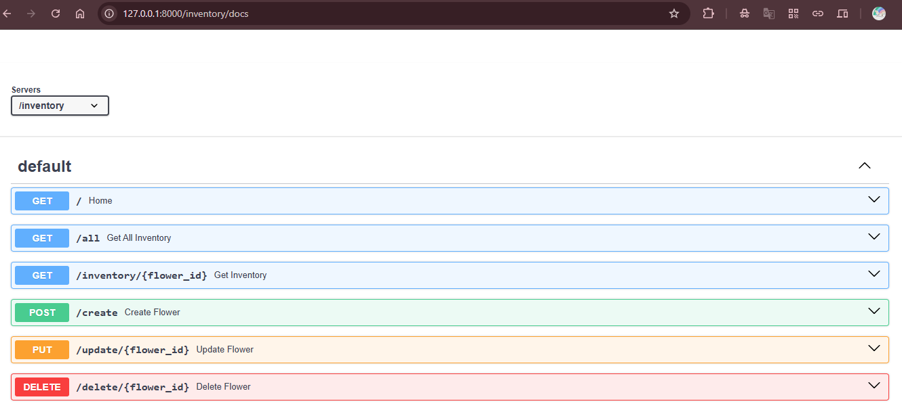

**GET /inventory**  
_List all flowers in inventory_  
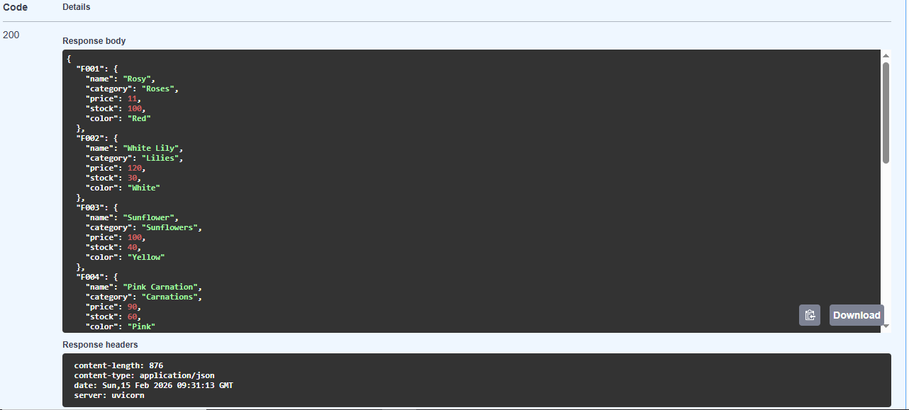

**POST /inventory/create**  
_Add a new flower_  
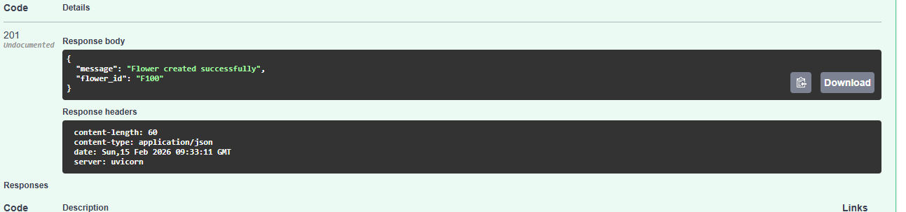

**PUT /inventory/update/{flower_id}**  
_Update existing flower_  
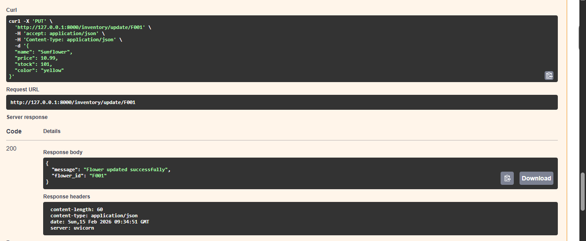

**DELETE /inventory/delete/{flower_id}**  
_Delete a flower_  
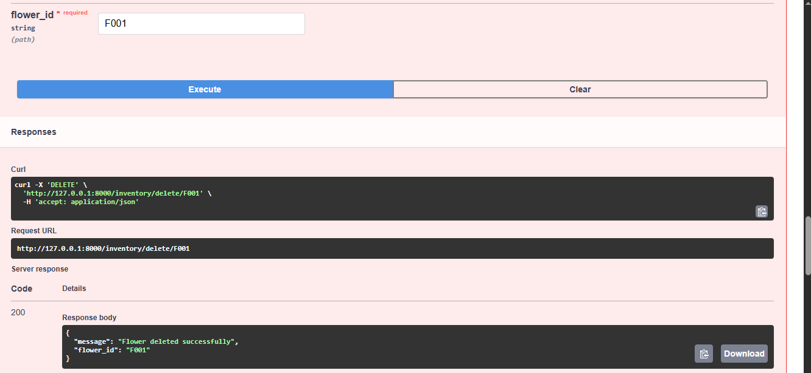

---

### 📦 Orders Endpoints

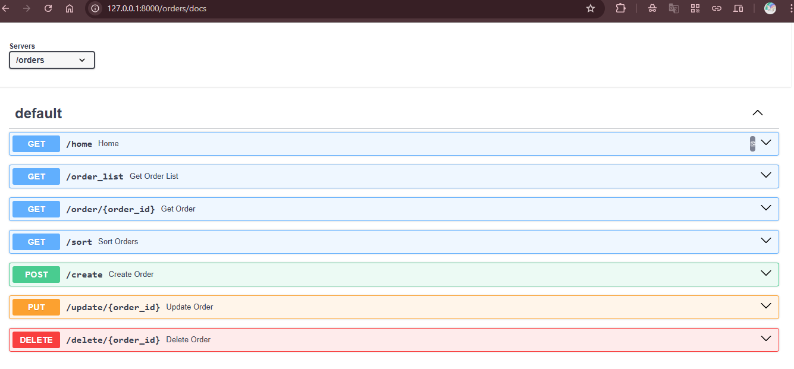

**GET /orders**  
_List all orders_  
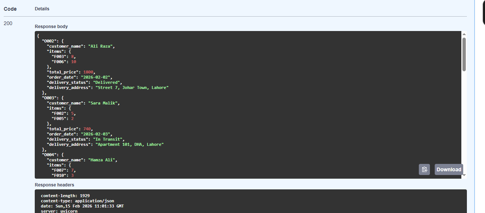

**POST /orders/create**  
_Create a new order_  
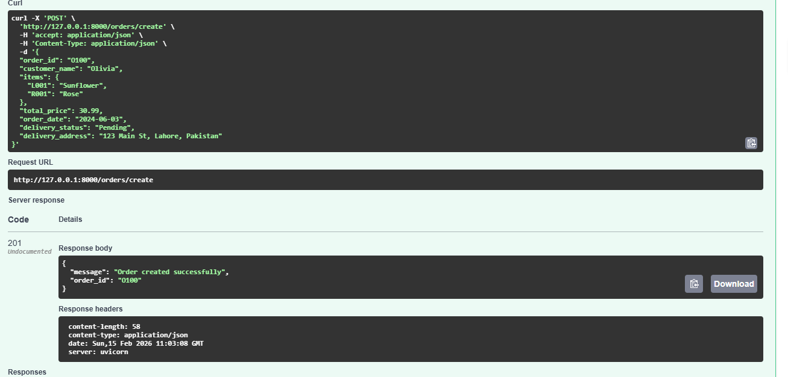

**PUT /orders/update/{order_id}**  
_Update an existing order_  
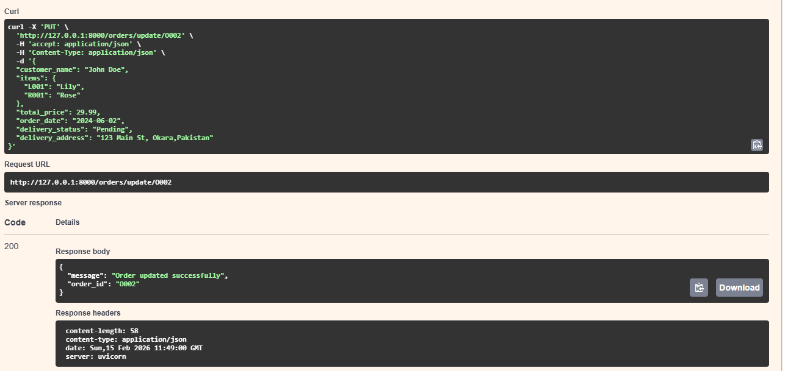

**DELETE /orders/delete/{order_id}**  
_Delete an order_  
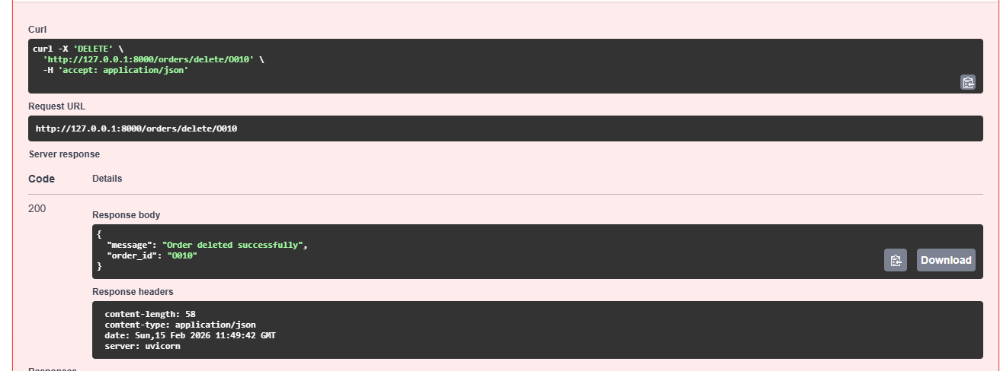

---

### 👥 Customers Endpoints

**GET /customers**  
_List all customers_  
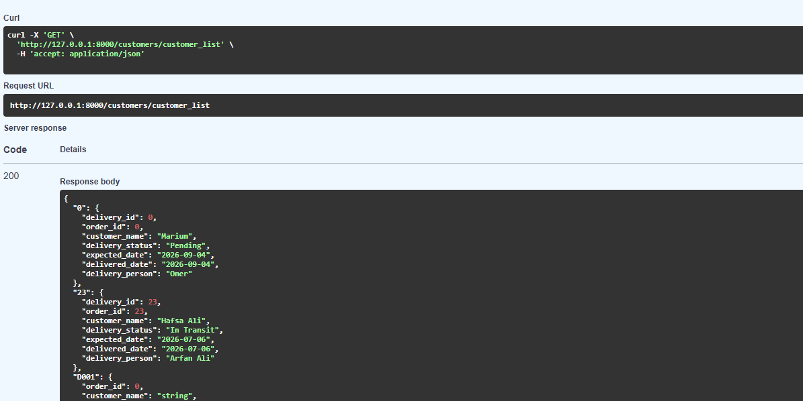

---

### 🚚 Delivery Endpoints

**GET /delivery**  
_List all deliveries_  
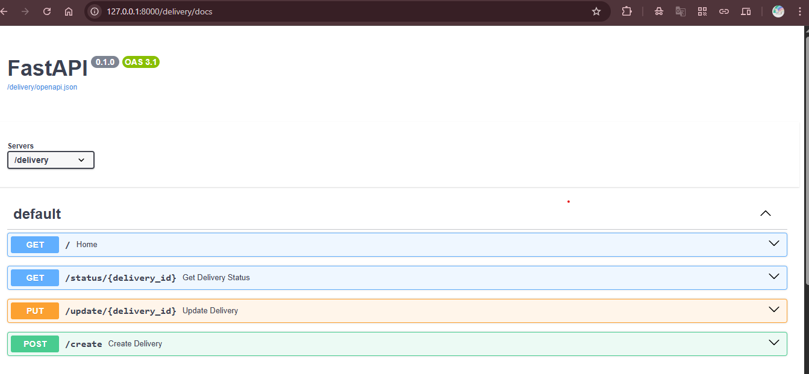

**POST /delivery/create**  
_Add a new delivery_  
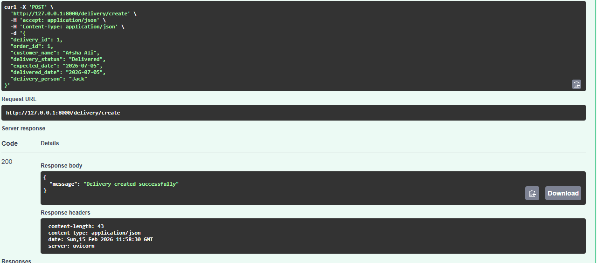

**PUT /delivery/update/{delivery_id}**  
_Update delivery status_  
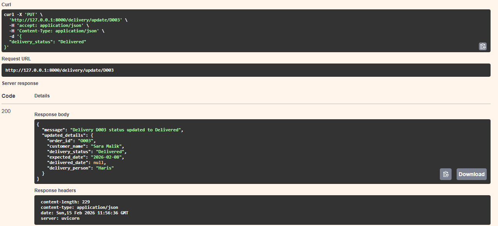

---

## 🚀 Installation

### 1. Clone the repository
> git clone https://github.com/mariumijay/Gulaura-API.git

> cd Gulaura-API

### 2. Create virtual environment
> python -m venv venv

### 3. Activate environment
Windows:
> venv\Scripts\activate

Mac/Linux:
> source venv/bin/activate

### 4. Install dependencies
> pip install fastapi uvicorn

---

## ▶️ Run the Server
> http://127.0.0.1:8000

Swagger Docs:
> http://127.0.0.1:8000/docs

---

## 📡 Example API Endpoints

- GET /flowers
- POST /orders
- GET /customers
- PUT /delivery/{id}
- GET /analytics/report

---

## 📌 Future Improvements

- Database integration (PostgreSQL or SQLite)
- Authentication and authorization
- Image upload for bouquets
- Machine learning based recommendations
- Async processing
- Logging and middleware

---

## 👩‍💻 Author

Marium  
BS Computer Science | Backend and AI Enthusiast

---

## 📄 License

This project is for educational and portfolio purposes.

